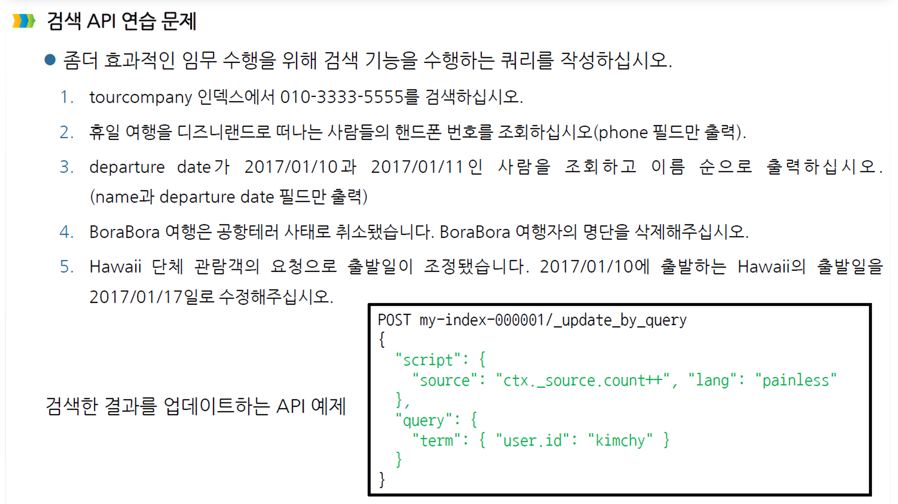

### 문제



### 0. 초기 데이터 정의

```js
POST tourcompany/_doc/1
{
  "name": "Alfred",
  "phone": "010-1234-5678",
  "holiday_dest": "Disneyland",
  "depature_date": "2017/01/20"
}

POST tourcompany/_doc/2
{
  "name": "Huey",
  "phone": "010-2222-4444",
  "holiday_dest": "Disneyland",
  "depature_date": "2017/01/20"
}

POST tourcompany/_doc/3
{
  "name": "Naomi",
  "phone": "010-3333-5555",
  "holiday_dest": "Hawaii",
  "depature_date": "2017/01/10"
}

POST tourcompany/_doc/4
{
  "name": "Andra",
  "phone": "010-6666-7777",
  "holiday_dest": "Bora Bora",
  "depature_date": "2017/01/11"
}

POST tourcompany/_doc/5
{
  "name": "Paul",
  "phone": "010-9999-8888",
  "holiday_dest": "Hawaii",
  "depature_date": "2017/01/10"
}

POST tourcompany/_doc/6
{
  "name": "Colin",
  "phone": "010-5555-4444",
  "holiday_dest": "Venice",
  "depature_date": "2017/01/16"
}
```

### 1. 정확한 전화번호 검색

```js
GET /tourcompany/_search
{
  "query": {
    "term": {
      "phone.keyword": "010-3333-5555"
    }
  }
}

GET tourcompany/_search?q="010-3333-5555"

```

### 2. 디즈니랜드로 떠나는 사람의 전화번호만 검색

```js
GET /tourcompany/_search
{
  "_source": ["phone"], 
  "query": {
    "match": {
      "holiday_dest": "Disneyland"
    }
  }
}

GET tourcompany/_search?q="Disneyland"&_source=phone

```

### 3. 출발일을 기준으로 검색을 수행하고 이름순으로 결과를 나열

```js
GET /tourcompany/_search
{
  "_source": ["name", "depature_date"], 
  "query": {
    "bool": {
      "should": [
        {
          "term": {
            "depature_date": "2017/01/10"
          }
        },
        {
          "term": {
            "depature_date": "2017/01/11"
          }
        }
      ],
      "minimum_should_match": 1
    }
  },
  "sort": [
    {
      "name.keyword": {
        "order": "asc"
      }
    }
  ]
}

GET tourcompany/_search?q=depature_date:"2017/01/10"OR depature_date:"2017/01/11"&sort=name.keyword:asc&_source=name AND _source=depature_date

```

### 4. 보라보라 여행자 검색하여 삭제 

```js
POST /tourcompany/_delete_by_query
{
  "query": {
    "match": {
      "holiday_dest": "Bora Bora"
    }
  }
}

```

### 5. 두 가지 조건에 일치하는 검색을 수행하고 그 결과에서 나온 정보를 업데이트

```js
POST /tourcompany/_update_by_query
{
  "query": {
    "match": {
      "holiday_dest": "Hawaii"
    }
  },
  "script": {
    "source": "ctx._source.depature_date = '2017/01/17'",
    "lang": "painless"
  }
}


POST tourcompany/_update_by_query
{
  "script": {
    "source": "ctx._source.departure_date='2017/01/17'",
    "lang": "painless"
  },
  "query": {
    "bool": {
      "must": [
        {"match": {"departure_date": "2017/01/10"}},
        {"match": {"holiday_dest": "Hawaii"}}
      ]
    }
  }
}
```
